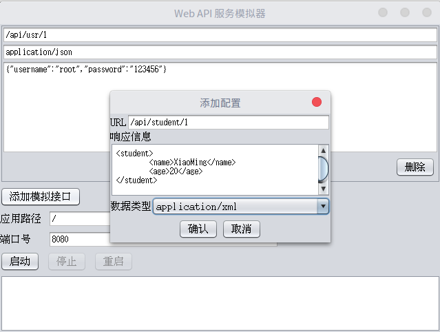
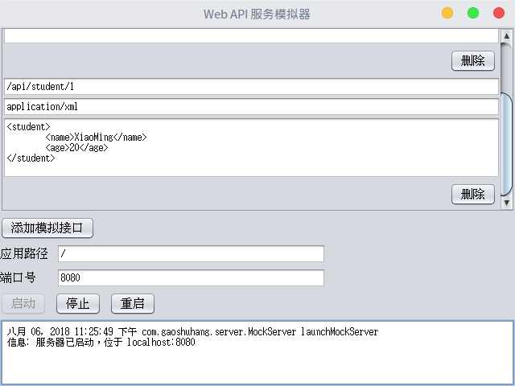

# HTTP接口服务端模拟器

这个软件用来模拟一个提供HTTP接口的服务器，用于辅助网页前端开发、移动端APP开发、桌面程序开发等。

## 坑

这个软件是Java的swing写的，使用的是Intellij IDEA的GUI Designer，这俩工具都太坑了！！！从代码到部署全是坑，再也不用swing和Intellij IDEA的GUI Designer了！！！

## 使用指南

### 如何构建

需要有Java 8，然后执行编译好的jar文件。

```
java -jar servmock.jar
```

从源码构建：导入工程到Intellij IDEA，然后点`Build->Build Artifacts...`

### 如何食用

开袋即食。

### 程序运行截图



